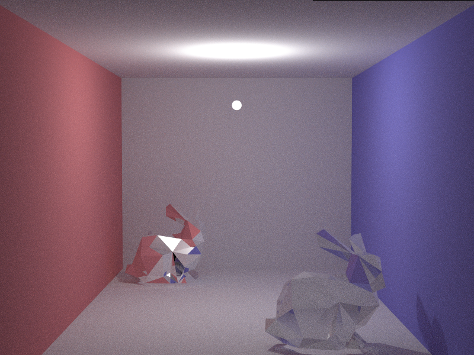

# smallpt

Explicit lighting version of smallpt

## Environment:

Linux Mint

## Commands:

* ```make; ./pt_cpu glut 4 null```

* ./pt_cpu {"glut"|"console"} {samplePerPixels} {objPath}

* pre-setting scenes: 
    
    * null: cornell box

    * bunny: stanford bunnies

    * haku: yowane haku

## Features:

* Supports Polygon Models (.obj)

* Supports Polygon Area Lights

* OpenMp (CPU) Accelerated

* GLUT based window display current results

## TODO:

* Sample texture texels is in progress, comments are leave in codes

## Results:

* Original Scenes


* Soft Shadows


* Hard Shadows


* Polygon Area Lights


* Misc




